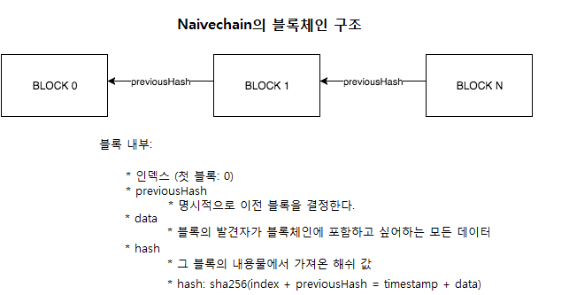
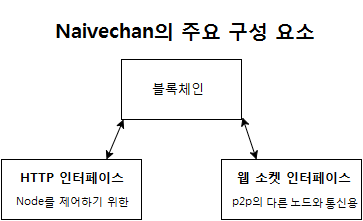

# Naivechain - a blockchain implementation in 200 lines of code

### Motivation
All the current implementations of blockchains are tightly coupled with the larger context and problems they (e.g. Bitcoin or Ethereum) are trying to solve. This makes understanding blockchains a necessarily harder task, than it must be. Especially source-code-wisely. This project is an attempt to provide as concise and simple implementation of a blockchain as possible.

 
### What is blockchain
[From Wikipedia](https://en.wikipedia.org/wiki/Blockchain_(database)) : Blockchain is a distributed database that maintains a continuously-growing list of records called blocks secured from tampering and revision.

### Key concepts of Naivechain
Check also [this blog post](https://medium.com/@lhartikk/a-blockchain-in-200-lines-of-code-963cc1cc0e54#.dttbm9afr5) for a more detailed overview of the key concepts
* HTTP interface to control the node
* Use Websockets to communicate with other nodes (P2P)
* Super simple "protocols" in P2P communication
* Data is not persisted in nodes
* No proof-of-work or proof-of-stake: a block can be added to the blockchain without competition







### Naivecoin
For a more extensive tutorial about blockchains, you can check the project [Naivecoin](https://lhartikk.github.io/). It is based on Naivechain and implements for instance Proof-of-work, transactions and wallets.

### Quick start
(set up two connected nodes and mine 1 block)
```
npm install
HTTP_PORT=3001 P2P_PORT=6001 npm start
HTTP_PORT=3002 P2P_PORT=6002 PEERS=ws://localhost:6001 npm start
curl -H "Content-type:application/json" --data '{"data" : "Some data to the first block"}' http://localhost:3001/mineBlock
```

### Quick start with Docker
(set up three connected nodes and mine a block)
###
```sh
docker-compose up
curl -H "Content-type:application/json" --data '{"data" : "Some data to the first block"}' http://localhost:3001/mineBlock
```

### HTTP API
##### Get blockchain
```
curl http://localhost:3001/blocks
```
##### Create block
```
curl -H "Content-type:application/json" --data '{"data" : "Some data to the first block"}' http://localhost:3001/mineBlock
``` 
##### Add peer
```
curl -H "Content-type:application/json" --data '{"peer" : "ws://localhost:6001"}' http://localhost:3001/addPeer
```
#### Query connected peers
```
curl http://localhost:3001/peers
```
